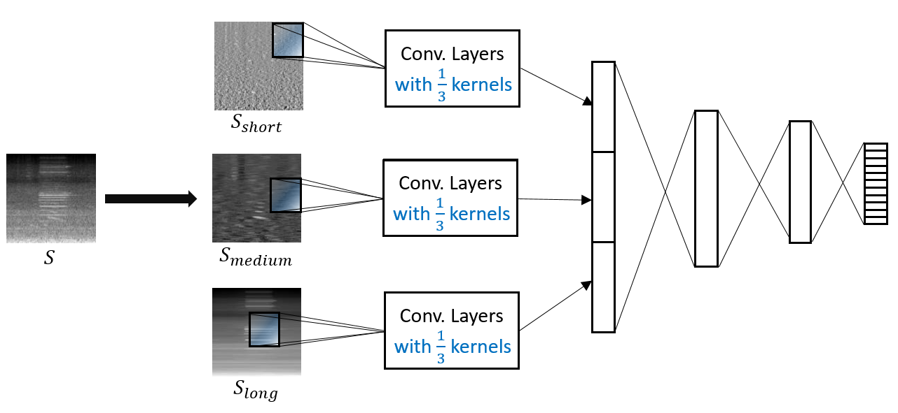
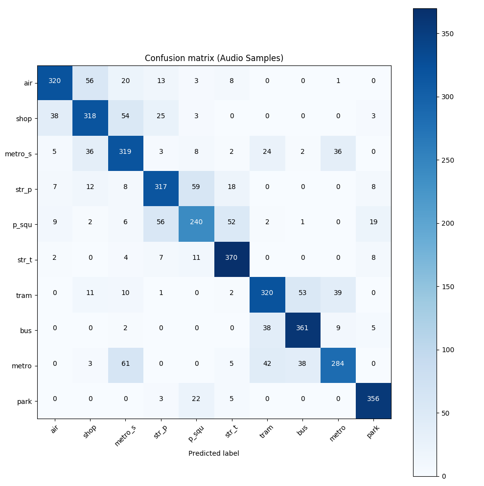

# Introduction

This repository includes the source code of my submitted Acoustic Scene Classification (ASC) system to Task 1A of the DCASE challenge 2019. The code is based on Python 3.5 and uses PyTorch 1.0.0.

The proposed system is based on an **AlexNet-like model** with **stratified log-Mel features**. "stratify" means that a given log-MEL image is decomposed as the combination of a number of component images, which correspond to sound patterns of different nature. Then each component image is modeled independently by a portion of convolution kernels in the CNN model.


~~If you would like to know more details about my ASC system, you can read my technical report here~~ (upcoming). 

# How to Use

There are two steps to run the system. First thing is to do audio feature extraction, i.e., extract log-Mel feature for each audio signal and decompose it into 3 component images. Then, we train and test the CNN model based on the component images.

## Audio Feature Extraction

To do feature extraction, use the script "extr-asc.py" in the folder "feat_extract_asc". Before running the script, set the paths of the raw dataset and the output folders. 'raw_data_folder' is the path to audios in development dataset. 'output_feature_folder' is where extracted features are stored. 'spectrograms_folder' includes the feature images for visualization purpose only.

```python
config = { ...
	'raw_data_folder': '.../TAU-urban-acoustic-scenes-2019-development/audio',
	'output_feature_folder': '.../features/development/logmel-128-S',
	'spectrograms_folder': '.../features/development/logmel-128-S-imgs',
	...
	}
```
Then run the script by
```python
python extr-asc.py
```

## Training and Testing

To train and test the CNN model with the **officially provided setup**, use the script "main.py" in "cnn_for_asc" folder. Before running the script, modify the following variables:

```python
gpu = 0 # specify which gpu is used for training and testing.
development_data_path = '.../features/development/logmel-128-S' # path to feature folder.
```
Then run the script by 
```python
python main.py
```
After the training and testing are completed, a result folder named "results-logmel128S-AlexNetS-Mixup-20eps" is generated. Check for model accuracy, confusion matrix and learning curve there. A single model that I trained with the scripts has an accuracy of **76.6%** on development dataset, and the confusion matrix is as follows:

